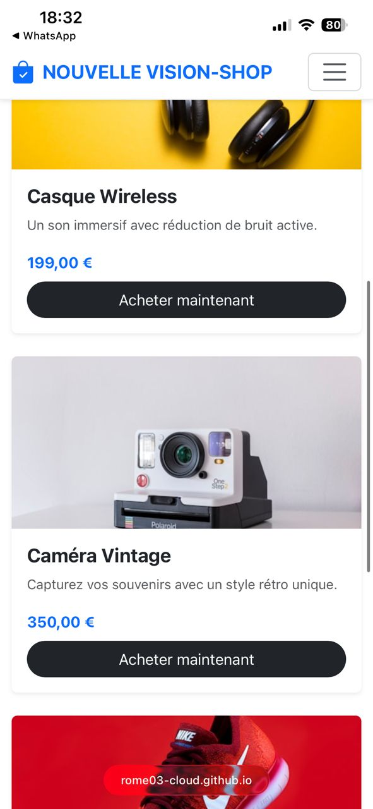
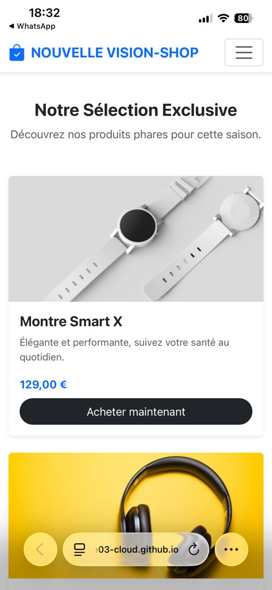
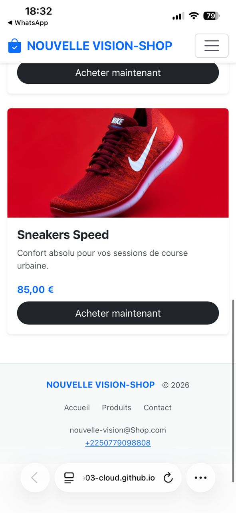

# 🛒 Projet Boutique Responsive

Ceci est ma page d'atterrissage responsive conçue avec *Bootstrap 5*.

## 📸 Captures d'écran

### Vue Ordinateur

### Vue Mobile

## 🛠️ Choix de conception
- *Framework :* Bootstrap 5 pour la structure et la réactivité.
- *Navigation :* Barre de menu fixe avec liens fluides.
- *Grille :* Utilisation du système de colonnes (12 sur mobile, 3 sur desktop).
- *Style :* Personnalisation CSS pour les effets de survol sur les produits.
